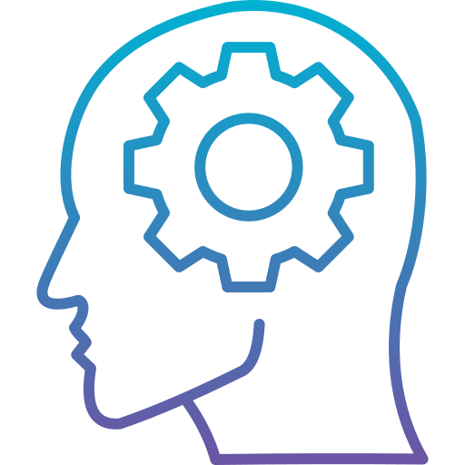

<div align="center">

  
  <h1>PHILOSOPHERS</h1>
  
  <p>
    Thinking about who uses which fork when?
  </p>
</div>
  
  # :notebook_with_decorative_cover: Table of Contents

- [:notebook_with_decorative_cover: Table of Contents](#notebook_with_decorative_cover-table-of-contents)
	- [:star2: About the Project](#star2-about-the-project)
		- [:dart: Features](#dart-features)
	- [:toolbox: Getting Started](#toolbox-getting-started)
		- [:gear: Installation](#gear-installation)
	- [:eyes: Usage](#eyes-usage)
	- [:compass: Roadmap](#compass-roadmap)
	- [:handshake: Contact](#handshake-contact)


## :star2: About the Project
A project made in accordance with the philosophers project for the Codam Core Curriculum.
In this project, we will learn the basics of threading a process.
we will see how to create threads and we will discover mutexes.
We will learn how to equally divide the forks among the philosopher so they don't starve to death.


### :dart: Features


## 	:toolbox: Getting Started

### :gear: Installation

Start by cloning the repository into your projects includes filder:
```c
git clone https://github.com/BasUitermark/philosphers.git
```

Compile by using make:
```c
make
```


## :eyes: Usage

```c

```


## :compass: Roadmap

* [ ] Write workflow.
* [ ] Research topic.
* [ ] Write tests.
* [ ] Write parser and checks.
* [ ] Write main code
* [ ] Bug fixing.
* [ ] Finish documentation.


## :handshake: Contact

See my profile page for ways to contact me!
